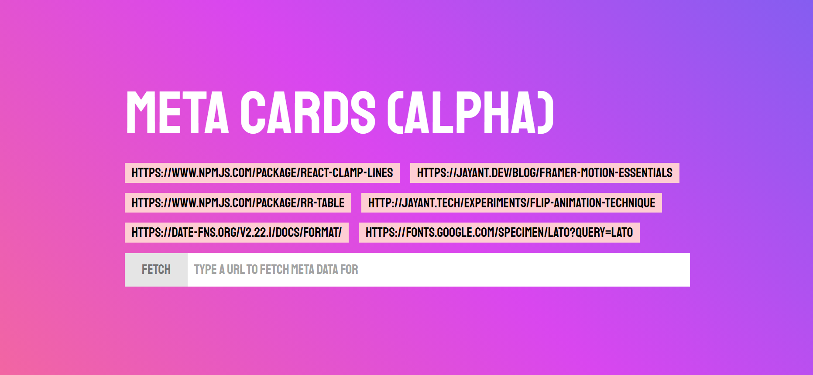

# Meta Cards

A site metadata preview tool to show what an unfurled link might look like on some of the most popular social sites.

## Development

```bash
yarn install
yarn dev

# built with
#  node 14.16.1 (LTS)
#  next.js 10.2
#  tailwindcss 2.1
```

## Currently supported (fully or partially)

- Twitter
- LinkedIn
- Slack
- Discord

**In progress**

- Telegram
- More variations of cards in the above sites

## Help needed

I'll need help for creating previews for the following products:

- Facebook
- WhatsApp
- Instagram

I'll also need help to cover as many different variations of meta cards as possible.
